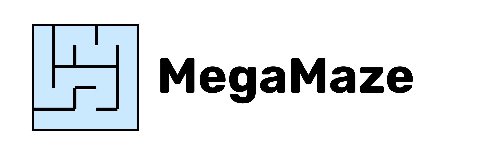
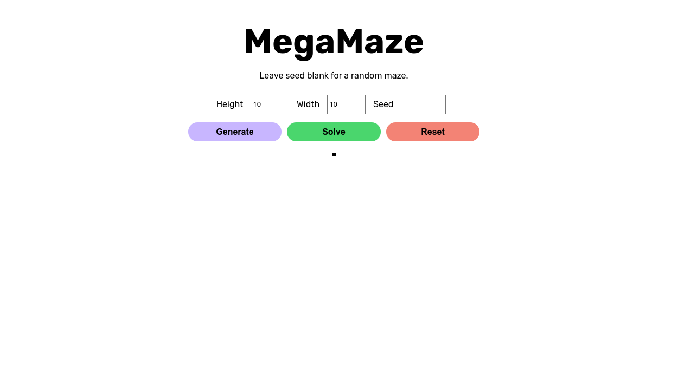
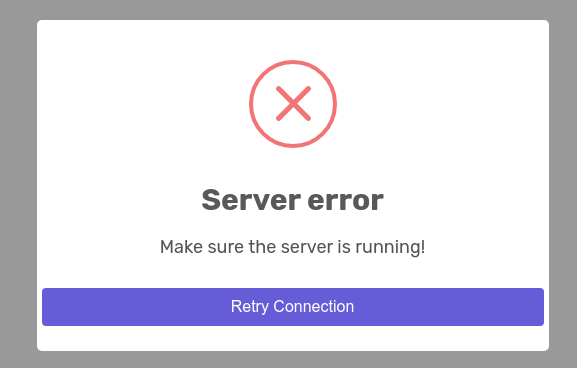
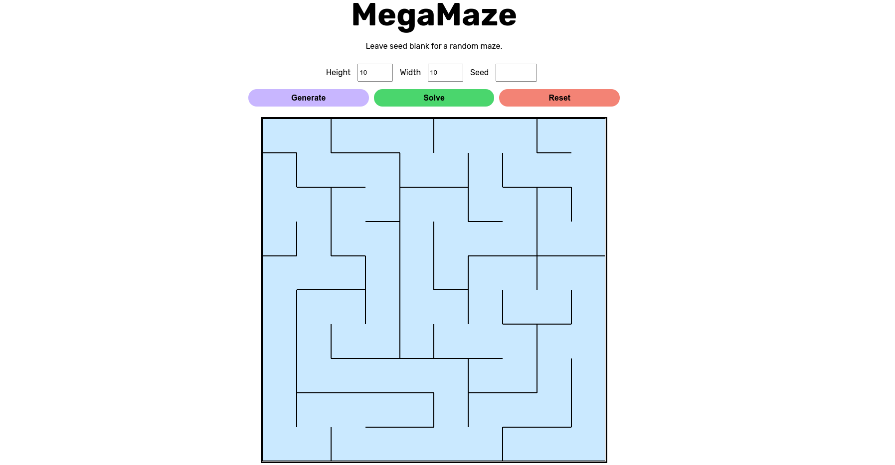
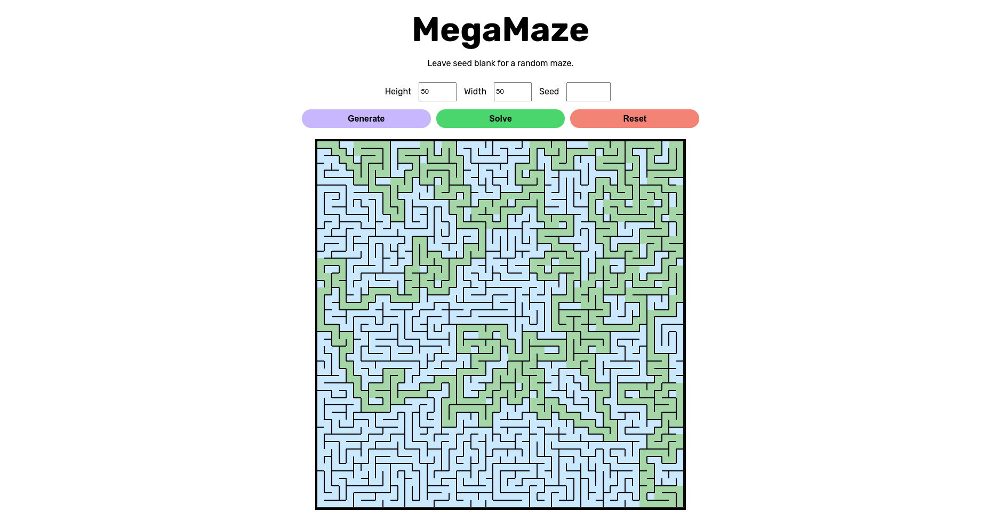

# About

Welcome to Project 1! In this project, you will implement a maze generator and solver in Java using what you've learned about graph and graph algorithms!

#  Getting Started
You will need to install [Java 11](https://www.oracle.com/java/technologies/javase-jdk11-downloads.html) if you have not already. If you are on Windows, you will also need [Git Bash](https://git-scm.com/download).

Once you have done so, open Git Bash (or your terminal, if on Mac/Linux) and type `https://github.com/atdp-dse/project-1-megamaze-<YOURNAMEHERE>` where `<YOURNAMEHERE>` is replaced by your group name.


## Mac/Linux Instructions
After the files finish downloading, type `cd project-1-megamaze-<YOURNAMEHERE>` to enter the directory you just created.

Now, run `./start` to start the server. You will need to do this every time you edit your code and want to view it on the GUI. If a server is already running, you can cancel it by pressing Ctrl+C in the terminal. (Alternatively, you can use the 'Run' feature of your IDE of choice.)

## Windows Instructions
Open the newly created folder in Explorer. You should see a file called "start.cmd". Double click on this command to start the server!

On the first run, it may take a couple minutes to install necessary files, and it may prompt you with some security warnings. You can accept these and subsequent runs should only take a few seconds to start up.

To update the server after code modifications, you can close the terminal window and re-run start.cmd.

## Using the GUI
To open the GUI, navigate to the `static/` folder in your file explorer and double-click `index.html`. This should open up a webpage in your browser that looks something like this:



If the following popup appears, then your server may not have started properly. Make sure that the terminal you ran `./start` in is still open.



It is normal that the buttons do not do anything at this point (their behavior is what you will be implementing!).

Assuming all went well, you are now ready to start developing!! Please post on Piazza or come to office hours if you are having issues getting set up.

# Part 1: Graph Implementation

To start off, you will create a fairly standard implementation of the Graph data structure! This will give us a more generic base for this project as well as any future times when you might need to use graphs for non-maze applications.

Source files can be found in `src/main/java/org/atdp`. There should be a file named `Graph.java` here, with some skeleton code to get you started. 

This particularly graph implementation is for an **undirected, unweighted graph.** This means that edges don't have numbers (weights) associated with them, and if an edge exists between two vertices, you can go from any one to the other.

Since the Vertex implementation requires a HashMap which is a data structure you haven't learned yet at this point, we've filled it out for you. Don't worry too much about what a HashMap is. You just need to know that you can add new items to it using `.add()`, very much like an ArrayList or LinkedList. 

## Testing
For this section only, there will be no hidden autograder tests since we want to make sure your graph implementation is solid before moving on to working with mazes! Tests are available in `src/test/java/org/atdp/GraphTest.java`. However, we don't guarantee that these tests are 100% comprehensive, so you might want to write some of your own if there are any edge cases that weren't covered.

# Part 2: Maze Generation

In the next part of this project, you will write an algorithm to generate random mazes. After completing this part, you should be able to click the "Generate" button and have something like this pop up!



## Thinking about Mazes
Mazes come in all sorts of shapes and sizes ([circle mazes](https://www.google.com/search?q=circle+maze), [hedge mazes](https://en.wikipedia.org/wiki/Hedge_maze#/media/File:Traquair_House_Maze.jpg)...) 

In this project we will be mostly concerned with rectangular mazes, where a bunch of square tiles are separated by walls. The eventual goal will be to find a path from the top left of the maze to the bottom right.

A nice way to think about mazes is to convert them into unweighted undirected graphs, where each square tile is a vertex. If it is possible to move directly from one tile to the next, then those two vertices are connected by an edge.

For example, the maze below:


can be represented by the graph:


The reason for using this abstraction will become clear once we start thinking about the algorithms needed to generate and solve the mazes.

As a general convention, you may think about the top left vertex being labelled 0, with the numbers incrementing by one from left to right in each row, until it reaches (length * width - 1) at the bottom right.

## The Maze Class
Source files can be found in `src/main/java/org/atdp`. Here, you will need to complete the `Maze` class, which extends the `Graph` class (a pretty standard graph implementation that should look familiar now that you've had a chance to make one yourself). You should review the functions and properties of `Graph` before starting to write any code, since they will be quite helpful.

First, you'll need to fill out the constructor. Documentation for the [Java Random object](https://docs.oracle.com/en/java/javase/11/docs/api/java.base/java/util/Random.html) will help with instantiating `gen`. You can pass in `seed` to `gen` to make sure that graphs with the same seed will always come out the same (since `gen` outputs a deterministic set of pseudorandom numbers if given the same seed).

> **IMPORTANT:** Make sure you use `gen` instead of creating a `new Random()` every time you need a random number for something! If you do the latter, your mazes might look very boring.

Next, you'll implement `generateMaze()` and `getNeighbors()`. After generateMaze is run (by the constructor), we should expect the maze to now hold the vertex and edge data representing a solvable graph.

[Wikipedia has a description of several maze generation algorithms](https://en.wikipedia.org/wiki/Maze_generation_algorithm) if you'd like to base your solution off of one (make sure to cite your sources though!)

You should be able to implement a generator based on Kruskal's or Prim's algorithm without needing any knowledge outside what you've already learned in class. As a hint, think about what these algorithms typically do (find a minimum spanning tree) and how you might be able to modify them slightly for this new application.

If you want an extra challenge though, feel free to try another method or invent your own algorithms!

## Maze Requirements
Although it's up to you what algorithm you'd like to write for maze generation, outputs should meet the following requirements:
1. All tiles must be connected. (There shouldn't be a square in the maze that can't be reached from the start.)
2. Tiles can only be directly connected to its neighbors (see the comment on top of `getNeighbors()` for more details).
3. Mazes created with the same seed, width, and height inputs should have the same layout (i.e. `m1.equals(m2)` should return true).
4. Mazes created with different seeds should be different. (Don't just return a maze with no walls every single time!!)

## Writing Tests
Make sure that you are creating custom tests throughout development to give yourself feedback and make sure things are going correctly. You can also submit periodically to Gradescope to run it against the staff tests, but we will not be releasing the code for these tests (as you should get practice writing your own!) 

We recommend writing a test for each of the requirements in the 'Maze Requirements' section above.

# Part 3: Creating a Maze Solver

Now that you can generate a whole bunch of mazes, let's figure out a way to solve them!

After completing this section, you should be able to click the "Solve" button and have an output that looks something like this:


> **IMPORTANT:** You must generate a maze by clicking "Generate" BEFORE clicking "Solve"! Otherwise, some errors may occur.

## The MazeSolver Class
There is only one method that you will need to implement for this section (`solve()` in `MazeSolver.java`), but you may find it necessary to create your own helper methods to break up the work.

We've given you a few objects that may be of use (`distTo`, `edgeTo`, and `pq`). The goal is to return the **shortest path** (hint hint hint) from the top left of the maze to the bottom right of the maze.

The output of this function should come in the form of a list of integers, where the 0th element in the list should always be 0, and the last element should always be the largest vertex label in the graph.

If you choose to use Java's [PriorityQueue](https://docs.oracle.com/en/java/javase/11/docs/api/java.base/java/util/PriorityQueue.html) implementation, we've given you a custom `DistComparator` that automatically sets the priority of vertices added to the priority queue to their respective entries in `distTo`. (To be clear, it is not required to use any of these given data structures; you can create your own if you don't want to use them.) 

> **IMPORTANT:** If distTo is changed, the PriorityQueue will NOT automatically update! To update the priority of a vertex in the PriorityQueue, remove the vertex using `pq.remove(v)` and then immediately add it back with `pq.add(v)`.

## Writing Tests

As with the previous section, we strongly recommend you to write your own tests, as the given test is not very comprehensive. Make sure that your solver works against mazes with non-square dimensions.

It is OK for your solver to assume that any mazes given to it are valid (ensuring that they are is Part 1's job).


# Part 3b: Making the Solver Fast


The following part is optional. We will have a friendly speed competition and announce the winners of the Fastest A* Maze Solver (FAMS) after the project is due!

If you'd like to improve solving speed, you can try creating a custom heuristic and using it with the A* algorithm! Some ideas:
 - Prioritize tiles that are closer to the bottom right
 - Check if tiles are dead ends and don't visit them they are

To write a test that times how long something takes to run, you can use the following code:
```java
long start = System.currentTimeMillis();
// YOUR CODE HERE
long end = System.currentTimeMillis();
double timeTakenInSeconds = (end - start) / 1000.0;
```

# Part 4: Write a Project Report
Tell us what you did!

In `projectreport.md`, write a brief paragraph or two answering the following questions in whatever format you want:
1. What algorithm did you choose for the maze generator? How does it work (in simple terms)?
2. How did you create your maze solver?
3. What was the biggest/best/worst/most fun challenge or bug that you solved while working on this project?

This project report is very open-ended, and there are no length requirements so there is no need to be too formal about it. The purpose of this is to get you in the habit of documenting your work so that if you come back to it in a month or a year, it will hopefully not look like a foreign language :)


# Submission and Grading
To submit your project, go to Gradescope, select the "Upload with GitHub" option, and choose the correct repository from the list. If you're working in a group, only one person in your group needs to submit. They can then use the "Add Group Member" option to add their teammate(s).

Once your project is submitted to Gradescope, it will be run against the staff autograder. There will be no hidden tests for this project, so the score you get on the autograder should be a good representation of your actual score. However, we reserve the right to assign a different score if we detect any plagiarism or deliberate attempts to cheat the autograder (of course, you are welcome to copy small code snippets from StackOverflow etc. as long as you cite the source in a comment and understand what they do).

You're more than welcome to work with other groups (in class, on Piazza, or through other means), but stay with discussing high-level strategies and ideas, and do not copy or send any code. 

If you have any questions, need debugging help, or have any suggestions about how to improve this project, feel free to contact us on Piazza or during class/office hours!